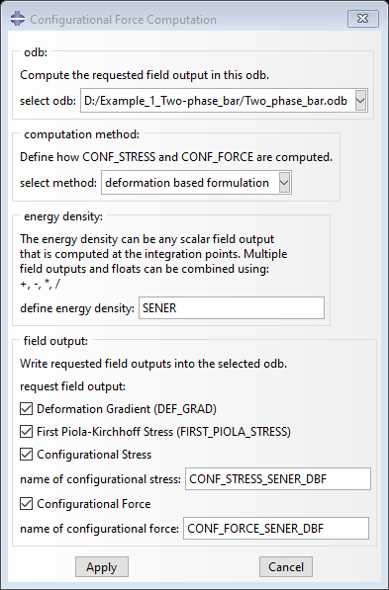

Readme
======


[](https://conforce.readthedocs.io/en/latest/?badge=latest)

Conforce is a python package to compute configurational (material) forces.
The computation is generated and compiled automatically from symbolic calculations into C-code.
A C-binding allows to access the C-functions from Python.
This makes conforce fast enough to compute a whole finite element model with several thousand elements.

Conforce features:

- the computation of the following quantities for common 2D and 3D elements:
  - static configurational forces
  - static configurational stresses
  - first Piola-Kirchhoff stresses
  - deformation gradients
- two formulations for the configurational stresses and forces:
  - motion based formulation (Eshebly's formulation)
  - displacement based formulation
- material models:
  - non-linear elasticity in the large strain framework
  - small-strain plasticity
- material orientations: The stresses and displacements are automatically rotated to the global coordinate system.


Supported Operating Systems:
- Windows (64-bit)
- CentOS (64-bit)
- other Linux distributions might work


Conforce is available as:
- Python 3 package
- Abaqus Plug-in

## Python 3 Package

The Python package requires Python 3 and contains:

- methods to compute:
  - configurational forces
  - configurational stresses
  - first Piola-Kirchhoff stresses
  - deformation gradients

### Installation 

#### PyPi

We recommend to install the latest stable version from PyPi.

````shell
pip install conforce
````

#### Remote Repository

The (unstable) development version of conforce can be installed 
from our remote repository.

1. Download and unzip [conforce repository](https://github.com/mrettl/conforce).
2. Open a shell in the unzipped folder where the *setup.py* file is located.
3. conforce is installed by
   ````shell
   pip install "."
   ````
   In order to run examples or build the documentation,
   additional packages are required.
   The following options are available.
   - Install requirements for the examples:
     ````shell
     pip install ".[examples]"
     ````
   - Install requirements to build the documentation
     ````shell
     pip install ".[doc]"
     ````
   - Install all requirements
     ````shell
     pip install ".[examples, doc]"
     ````
   
4. To uninstall the package, type:
    ````shell
    pip uninstall conforce
    ````

If git is available, the package can be installed directly from the remote repository by
````shell
pip install "conforce[examples, doc] @ git+https://github.com/mrettl/conforce"
````
The extras `examples` and `doc` are optional.

### Usage

Configurational forces are computed using the `cf_c` module.
The energy density `e`, the undeformed positions `X`,
the displacement `U` and the symmetric Cauchy stress tensor `S`
are passed to the `compute_CF` function alongside the element type and the computation method.

````python
from conforce_shared import cf_c

cf_c.compute_CF(
    e_at_int_points=[[10.]],
    X_at_nodes=[[
        [0., 0.],
        [1., 0.],
        [1., 1.],
        [0., 1.],
    ]],
    U_at_nodes=[[
        [0.0, 0.0],
        [0.1, 0.0],
        [0.1, 0.0],
        [0.0, 0.0],
    ]],
    S_at_int_points=[[[
        [100., 0.0],
        [0.0, 0.0]
    ]]],
    element_type="CPE4R",
    method="dbf"
)
````

This yields the configurational forces at the element nodes:

````
array([[[ 0., -5.],
        [ 0., -5.],
        [ 0.,  5.],
        [-0.,  5.]]])
````


## Abaqus Plug-in

The Abaqus Plug-in contains:

- methods to compute:
  - configurational forces
  - configurational stresses
  - first Piola-Kirchhoff stresses
  - deformation gradients
- Abaqus specific code to read and write to *.odb files
- a GUI for the Abaqus Plug-in

Supported Abaqus versions:
- \>= Abaqus 2017

### Installation

Open 
[https://github.com/mrettl/conforce/releases](https://github.com/mrettl/conforce/releases)
and download the latest zip file called `conforce_plugin_{version}.zip`.
The zip file has the following structure:

- `conforce_plugin_{version}.zip`
  - `conforce`
    - `conforce_abq_plugin.py`
    - ...

To install the Abaqus Plug-in, unzip the file in one of the following valid `plugin-folder`:

- `plugin_central_dir`: This is an Abaqus environment parameter.
  A Plug-in in this folder is accessible regardless of the home
  or current directory. For many installations this folder is located in
  `C:\\SIMULIA\\CAE\\plugins\\{year}`.
- `home_dir\abaqus_plugins`: This is the folder in which Abaqus is started.
- `current_dir\abaqus_plugins`: The current work directory can be changed inside Abaqus.
  Navigate to `File -> Set Work Directory ...` to define this folder.

The folder tree should look like:

- `plugin-folder`
  - `conforce`
    - `conforce_abq_plugin.py`
    - ...

Start Abaqus and navigate in the toolbar to `Plug-ins -> Conf. Force`.
The GUI of the Plug-in should open.
If no toolbar entry called `Conf. Force` exists, check if the Plug-in is stored in the right folder 
for the Abaqus version you are using.


### Usage

Open an *.odb file in Abaqus.
Navigate in the toolbar to `Plug-ins -> Conf. Force`.
The Plug-in gui opens:



Click Apply to compute the requested field outputs.


## Report Bugs, Ask questions

Use the [github issue tracker](https://github.com/mrettl/conforce/issues) to report
bugs and troubles or to ask questions.
If you like our tool, we would be happy if you leave a star on our Github repository.
